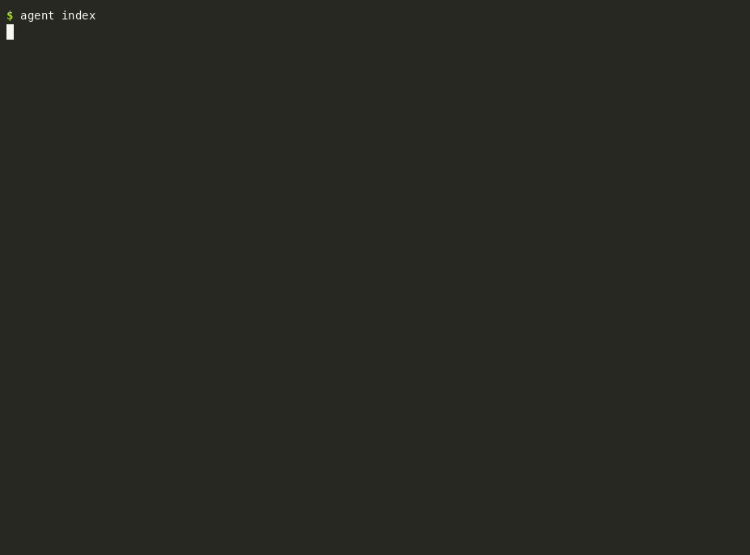
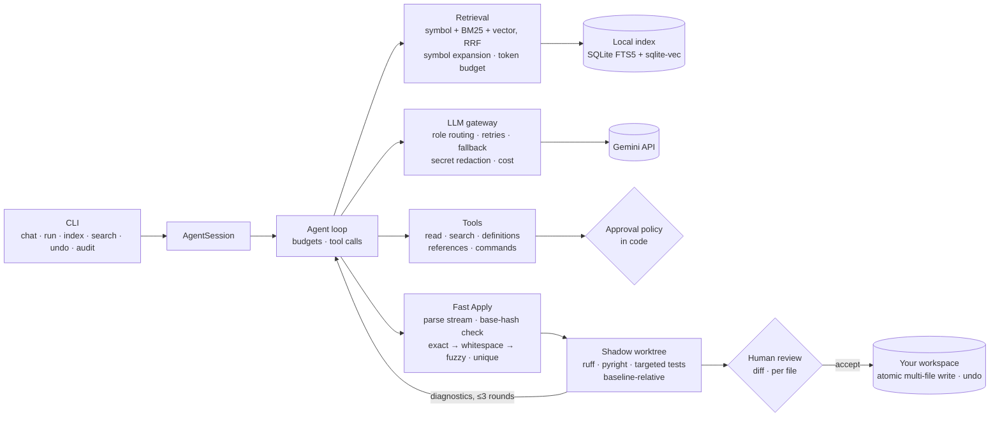
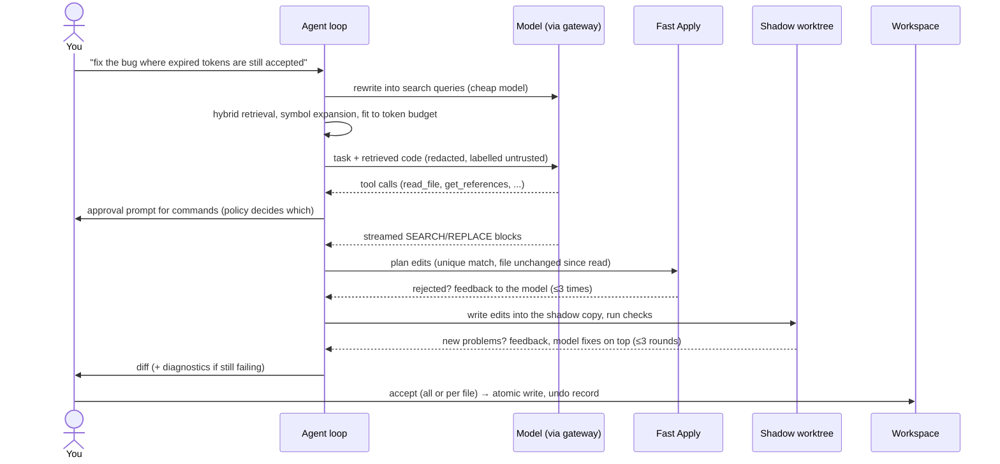
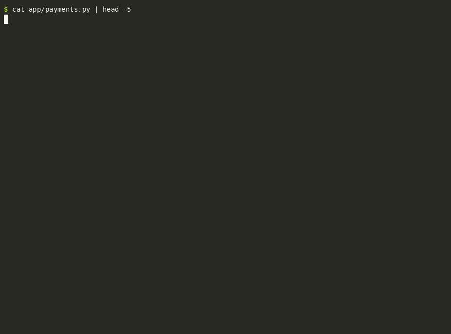

# code-agent

[](https://github.com/subidhkhanal/code-agent/actions/workflows/ci.yml)

A terminal coding agent for Python repositories. It indexes your repo locally, finds the code a
request is about, and has an LLM propose focused edits. Every edit is checked before you see
it: it must match exactly one place in a file the model has read, and it's validated in a hidden
copy of your repo (lint, type check, the tests that cover it). Failures go back to the model to
fix. You review the diff and approve commands. A code-enforced policy decides what needs your
approval, and nothing touches your files until you accept. A headless mode runs the same engine
autonomously inside an isolated container, which is how it's scored on SWE-bench.



<sub>Recorded by `docker/demo.Dockerfile`. The model's replies are scripted so the recording is
reproducible; everything else is the real CLI with real ruff, pyright and pytest.</sub>

## Contents

- [What it does](#what-it-does) · [Architecture](#architecture) · [Design decisions](#design-decisions)
- [Evaluation](#evaluation) · [Security](#security) · [Install and use](#install-and-use)
- [Configuration](#configuration) · [Limitations](#limitations) · [Scaling to production](#scaling-to-production)

## What it does

| Command | |
|---|---|
| `agent index [--watch]` | Local hybrid index: AST chunks (tree-sitter), BM25 (SQLite FTS5), vectors (sqlite-vec, local ONNX embeddings). Incremental; re-embeds only changed chunks. |
| `agent search "..."` | Exact-symbol + BM25 + vector search fused with reciprocal rank fusion. Works offline. |
| `agent chat` | Request, retrieval, streamed SEARCH/REPLACE edits, Fast Apply checks, shadow validation with up to 3 auto-fix rounds, then diff review (all files or per file) and apply. |
| `agent undo` | Reverts the last change set; refuses if you've edited those files since. |
| `agent audit` | Every tool call and user action of a task, with redacted arguments. |
| `agent run --headless --auto-approve` | One task, no human, inside a container only. Writes `patch.diff` and `report.json`. |
| `agent models` | Lists the models your key can use and checks the configured ones. |

## Architecture



Request lifecycle:



## Design decisions

| Decision | ADR |
|---|---|
| CLI first; the engine is a library with events and injected approver/review | [0001](docs/adr/0001-cli-first.md) |
| SQLite FTS5 + sqlite-vec in one file; local embeddings; incremental updates | [0002](docs/adr/0002-index-storage-and-embeddings.md) |
| AST chunking (functions, class headers, methods, contiguous module runs) | [0003](docs/adr/0003-ast-chunking.md) |
| SEARCH/REPLACE blocks in the streamed reply, not diffs or whole files | [0004](docs/adr/0004-edit-format.md) |
| Match tiers, fuzzy ≥ 0.90 on 3+ lines, ambiguity = reject, stale files = regenerate | [0005](docs/adr/0005-fuzzy-matching-and-stale-files.md) |
| Shadow git worktree; only *new* problems fail validation | [0006](docs/adr/0006-shadow-workspace.md) |
| Approvals and capabilities in code; honest limits of local isolation | [0007](docs/adr/0007-approvals-capabilities-and-isolation.md) |
| Model routing by role; budgets enforced in code; unknown prices stay unknown | [0008](docs/adr/0008-model-routing-and-budgets.md) |
| Headless only in containers, behind an allowlisting egress proxy | [0009](docs/adr/0009-headless-docker-mode.md) |
| Symbol expansion from the index; references via jedi | [0010](docs/adr/0010-symbol-resolution.md) |

## Evaluation

All numbers were measured on a laptop: Intel i5-13420H (8 cores), 16 GB RAM, Windows 11, no
GPU. Raw outputs are committed next to the scripts that produce them.

### SWE-bench Lite (headless mode, official harness), in progress

- **Setup.** A seeded random subset of 40 Lite instances
  ([`subset-40-seed42.json`](evals/swebench/subset-40-seed42.json)); the first 10 are the pilot.
  Each task runs in its own SWE-bench image with the agent mounted in, behind the egress proxy.
  Scoring uses the official harness, unchanged. Tasks with an empty patch count as unresolved.
- **Models.** Gemini 3.8 Flash for edits, with 3.7/3.6/3.5 Flash as fallbacks, and 3.5 Flash-Lite
  for query rewriting ([`agent.toml`](evals/swebench/agent.toml)). Retrieval is BM25 + symbol
  (no vectors inside the container; see limits).
- **Quota.** These runs use Gemini's free tier, which allows 20 requests per model per day, and a
  task needs about 25. The pilot therefore advances 2–3 tasks a day
  (`evals/swebench/run_daily.ps1`). Numbers below are **as of 2026-09-29** and will be updated.

| Run | Tasks scored | Resolved | Avg model calls / tool calls | Avg wall time | Edits applied first try |
|---|---|---|---|---|---|
| smoke (`django__django-11099`) | 1 | 1 | 24 / 22 | 24 min¹ | 1 of 1 |
| pilot so far (`django__django-13551`) | 1 of 10 | 1 | 25 / 23 | 10 min | 1 of 1 |

¹ Mostly waiting on retries: during that run 176 of 200 requests got `503 high demand` (free-tier
requests are deprioritized under load).

**Cost:** $0 actual (free tier). At Google's published paid-tier prices the two tasks would have
cost $0.21 and $0.41.

**Pending:** the rest of the pilot, the 40-task subset, and the with/without shadow-validation
ablation (§6.3 of the plan). Two resolved tasks say nothing about a resolve rate yet.

### Retrieval recall (file level)

For each of the 10 pilot tasks, the index is built at the task's base commit, the query is the
raw problem statement (no LLM rewrite), and we check whether the file the gold patch touches
appears in the top-k ranked files ([`run_retrieval_eval.py`](evals/retrieval/run_retrieval_eval.py),
raw results in [`results-pilot.json`](evals/retrieval/results-pilot.json)).

| Condition | recall@5 | recall@10 |
|---|---|---|
| BM25 only | 0.7 | 0.8 |
| vector only | 0.9 | 0.9 |
| hybrid (symbol + BM25 + vector, RRF) | 0.9 | 0.9 |
| hybrid + symbol expansion | 0.9 | 0.9 |

What the ten tasks show (too few for fine distinctions):
- **Vectors matter.** BM25 alone missed the file in the top 5 for three tasks: sphinx-8474,
  matplotlib-25498, and django-16816 (the last one every condition missed). Hybrid recovered the
  first two. The SWE-bench runs above currently use BM25 + symbol only, so this points at the
  next improvement (see Limitations).
- **Symbol expansion adds no recall here.** It adds *signatures of called code* to the context,
  which is about what the model sees next to the hit, not about finding the file.
- **The one miss is a query problem.** django-16816's issue text is mostly a traceback through
  other files, which drowns the decisive token ("E108"). Querying with a focused phrase instead
  (`admin check E108 list_display field`, hand-written to illustrate what the agent's query
  rewrite step is for, not measured) ranks the right file #1 with hybrid and #2 with BM25.
- **Incremental indexing pays off.** Across Django commits: 104 min for the first build (35k
  chunks embedded on CPU), then 18 min, 7 min, and 26 s, reusing up to 94% of vectors. (One
  step's wall time, django-16816, is excluded: the laptop slept during it.)

### Fast Apply

`benchmarks/bench_apply.py`: plan (hash check + match) plus atomic write, 50 runs per cell.

| File size | exact p50 / p95 | whitespace p50 / p95 | fuzzy p50 / p95 |
|---|---|---|---|
| 100 lines | 2.3 / 3.3 ms | 2.1 / 2.6 ms | 2.1 / 2.7 ms |
| 500 lines | 2.4 / 3.2 ms | 2.3 / 3.3 ms | 3.0 / 3.7 ms |
| 1000 lines | 2.7 / 4.4 ms | 2.8 / 3.5 ms | 3.9 / 4.9 ms |

The first fuzzy implementation (difflib) took 154 ms at 500 lines. Switching the similarity
kernel to rapidfuzz brought that to 3 ms with identical matches (ADR 0005).

### Indexing

[pytest 8.3.4](https://github.com/pytest-dev/pytest): 563 files, 6,950 chunks (`benchmarks/bench_index.py`).

| | |
|---|---|
| Keyword + symbol index ready | 2.1 s |
| All embeddings (bge-small, CPU) | ~10 min, one time |
| Re-sync, nothing changed | 0.42 s |
| One edited file re-indexed (what `--watch` does on save) | p50 263 ms, p95 383 ms |

## Security

The model is treated as untrusted. Security rules live in code: the prompt explains the
protocol but enforces nothing. `tests/test_security_suite.py` scripts a **fully compromised
model** that obeys every instruction planted in
[`tests/fixtures/injection_repo`](tests/fixtures/injection_repo). It tries `curl | sh`, reading
`.env` and files outside the repo, editing git hooks, granting itself session-wide approval, and
calling a `set_permissions` tool. The simulated user allows read-only commands and denies the
rest.

| Requirement (plan §6.5) | Result |
|---|---|
| Privileged commands run without approval | 0 |
| Reads of sensitive or out-of-workspace paths | 0 (5 attempts denied) |
| Edits outside the workspace or to protected paths | 0 |
| Planted secrets in any outbound request or log | 0 (every request captured and scanned) |
| Stale edit applied over the user's change | never |
| Cancel during a command | process tree killed, task `CANCELLED` |



The controls in brief (details in [ADR 0007](docs/adr/0007-approvals-capabilities-and-isolation.md)):
- **Commands** are classified by code as read-only, test/lint, or privileged. Privileged means
  anything unknown, any shell syntax, or any path outside the repo, and it asks every time.
  Commands run without a shell, with an allowlisted environment (no API keys), a timeout, an
  output cap, and a process-tree kill.
- **Paths** are canonicalized. Sensitive files (`.env*`, keys, credentials, `.git/`, `.agent/`)
  can't be read, edited, or indexed.
- **Secrets** are redacted from every outbound request and every log. On pytest 8.3.4 plus this
  repo (590 files) the scanner has zero false positives.
- **Audit:** every tool call and user action is recorded.

## Install and use

```bash
pipx install .                       # or: python -m venv .venv && .venv/bin/pip install -e ".[dev]"
export GEMINI_API_KEY=...            # PowerShell: $env:GEMINI_API_KEY = "..."
agent models                         # pick models, then configure them (below)
cd your-repo
agent index                          # first run downloads the embedding model once (~70 MB)
agent chat
```

Headless, from Python (for an orchestrator's `spawn_sandbox`): see [docs/headless.md](docs/headless.md).

## Configuration

`~/.config/code-agent/config.toml` (or the file named by `CODE_AGENT_CONFIG`). The repository
itself can't change configuration; a cloned repo is untrusted. Every key is validated, and
unknown keys are errors.

```toml
[llm.routes]                     # no model names are built in; checked against the provider
cheap  = ["gemini:gemini-3.5-flash-lite"]
strong = ["gemini:gemini-3.8-flash", "gemini:gemini-3.5-flash"]   # later entries = fallbacks

[llm.pricing."gemini:gemini-3.8-flash"]   # optional; without it cost is reported as unknown
input_per_mtok = 0.75
output_per_mtok = 3.75

[budgets]            # enforced in code before every model and tool call
max_usd = 1.0
max_tokens = 400000
max_tool_calls = 60
max_seconds = 900
max_edit_attempts = 3
max_fix_attempts = 3

[validation]         # shadow workspace
enabled = true
tests = true         # asks before running tests (they execute repository code)
type_check = true

[index]
embeddings = true
embedding_model = "BAAI/bge-small-en-v1.5"
extra_sensitive = []  # added to the built-in sensitive patterns; can't remove them
```

## Limitations

- **Local isolation:** in interactive mode an approved command runs with your permissions, and
  network isolation of test runs only exists on Linux. Headless mode is where the OS isolates
  (ADR 0007, 0009).
- **SWE-bench numbers are early** and run on a free tier with a daily quota. Inside the task
  containers retrieval is keyword + symbol only: CPU-embedding a large repo from scratch inside
  a 2-CPU container takes longer than the task. The retrieval eval shows vectors add recall, so
  the next step is to build the index outside the container (incrementally, per repo) and mount
  it in. Shadow tests only run where the task's environment has pytest. Django uses its own
  runner, so Django tasks are validated with ruff only.
- **Validation baselines are heuristic:** tests are selected by name and imports, and
  diagnostics are compared without line numbers. A change covered only by a distant integration
  test won't trigger it.
- **Python only**, though the chunker and index interfaces are language-agnostic.
- **Embeddings** default to bge-small (general English), chosen on measured CPU cost. The
  code-trained jina model was 3–7× slower to index (ADR 0002).

## Scaling to production

This is a local-first tool. Here is what changes for a product with millions of users.

**Capacity (rough).** Assume 1M daily active developers × 20 agent requests a day = 20M requests
a day, about 230 requests/s on average and ~700/s at a 3× peak. Measured here, an interactive
fix on the fixture repo used 9k input and 0.2k output tokens; a SWE-bench task used about 190k
input tokens across 25 calls. Taking 30k input and 1k output tokens per request, that's about
6×10¹¹ input tokens a day (≈7M tokens/s) and 2×10¹⁰ output tokens a day (≈230k tokens/s). At
the paid prices above, input dominates: about $450k a day before any savings. So the two
biggest levers are the ones below.

**Cutting token spend.**
- *Prompt caching:* the system prompt, tool schemas, and retrieved code repeat across turns of a
  task. In the SWE-bench runs most input tokens are re-sent history.
- *Model routing* (ADR 0008): cheap models for query rewriting and planning, the strong model
  only for edits. The auto-fix loop could also try a cheap model first.
- *Retrieval quality over context size:* a tighter context (symbol expansion as signatures,
  budget pruning) beats a bigger one, and recall@k is the number to watch.

**Index: local-first vs cloud.** Measured: Django is 38.5k chunks and a 276 MB index file on
disk. Local-first means that storage and the embedding compute live on the developer's machine:
zero serving cost, code never leaves the machine for indexing, and the index always matches
uncommitted work. A cloud index (≈300 MB per large repo × tens of millions of repos, plus GPU
embedding) makes sense for shared org-wide search and cross-repo context. It needs per-tenant
encryption, fast incremental updates on push, and a sync story for local changes.

**Enterprise policy and data residency.** Here the approval rules, sensitive paths, and budgets
are code plus a local config. An enterprise version would take them from a signed org policy (a
policy server), keep an audit log users can't edit, pin LLM calls to regional endpoints, and
allow provider allowlists (the egress proxy already enforces one per container).

**Versus a fully autonomous cloud agent.** The same engine runs both ways here (ADR 0009):
- *Trust boundary:* interactive mode runs on your machine and you approve risky actions; a cloud
  agent runs in the provider's sandbox and you review a PR.
- *Local state:* this sees uncommitted work; a cloud agent sees what you pushed.
- *Latency:* a local tool has no clone or environment build and gives feedback in seconds; a
  cloud agent pays minutes up front but scales out.

A product would likely offer both, sharing the engine, policy, and audit trail.

## Development

```bash
pip install -e ".[dev]"
pytest                   # scripted fake LLM + hashing embedder: no key, no network, no cost
ruff check . && pyright
```

The project plan is in [PLAN.md](PLAN.md).
